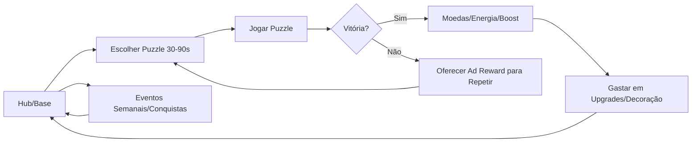

# Plano Jogo Hybrid-Casual Puzzle/Simulação

## Conceito

- Puzzle rápido 30–90s (match simples ou física) gerando moedas/energia para evoluir um hub (cidade/loja/base) com upgrades visuais claros e progressão aditiva.
- Estilo leve e colorido, UI minimalista, feedbacks curtos e recompensas frequentes; partidas iniciam em 1–2 toques.
- Meta clara: completar fases diárias, desbloquear áreas, decorar/expandir e participar de eventos semanais para manter retorno diário.

## Mecânicas Principais

- Core loop: entrar no hub → iniciar puzzle → vencer/perder → recompensas (moedas/energia/booster) → retorno ao hub.
- Meta loop: gastar recursos em upgrades (velocidade de produção, capacidade, estética), decorar áreas, expandir slots/fases; desbloqueios por marcos de nível do jogador e do hub.
- Energia/progressão: energia limitada recarregável + anúncios recompensados; streak diário concede energia extra/booster; timers curtos para incentivar sessões curtas e múltiplas por dia.
- Eventos semanais: leaderboard por pontos de evento, missões temáticas, loja temporal de itens cosméticos/boosters; conquistas de longo prazo com gemas/moedas premium.
- Social: leaderboard global/por país, apelido simples, compartilhamento de conquistas; opcional guildas leves (tarefa cooperativa semanal com baús).

## Monetização

- Ads: rewarded em pontos de fricção (energia baixa, retries, 2x recompensa, abrir baú instantâneo); interstitials suaves no retorno ao hub a cada 2–3 partidas vencidas e nunca após derrota; frequência calibrada por sessão (primeiro inter após 3 puzzles).
- IAPs: starter pack barato (remoção de ads inter por 7 dias, gemas, booster), skins temáticas do hub/unidades, boosts de tempo/energia, passe mensal simples (missões extras, moeda premium diária, skin exclusiva). Evitar pay-to-win, focar conveniência e cosmético.
- ARPU/retention: ofertas dinâmicas por comportamento (baixa energia, churn risk), preços regionais, bundles por evento, calendário de login com itens premium leves; A/B via Remote Config.

## UI/UX

- Telas: hub/base com toques rápidos para coletar/gastar; cena de puzzle; tela de upgrades/decoração; loja (ads/IAP); eventos/leaderboard.
- Onboarding: 3–5 passos guiados (jogar 1 puzzle, gastar moedas em upgrade, assistir 1 ad reward opcional, mostrar loja); tooltips contextuais curtos.
- Indicadores: barras de progresso de área, contadores de energia e moedas sempre visíveis, popups de recompensa rápidos, fila de timers clara.
- Animações: curtas (<600ms), squash-and-stretch leve, feedbacks de toque e coleta, transições rápidas entre hub/puzzle.

## Stack Recomendada

- Engine: Unity (principal) com URP 2D/leve; alternativa Godot 4 para 2D puro se time preferir open-source.
- Backend (se precisar): Firebase Auth (anônimo + upgrade), Firestore/RTDB para perfis leves, Remote Config para balance/AB, Cloud Functions para leaderboards/eventos; push via FCM.
- Analytics/LiveOps: Unity Analytics ou Firebase Analytics (funil de fases, D1/D7, ARPU, churn), Remote Config para eventos/balance.
- Ads & Monetização: AdMob + Unity LevelPlay mediação; Google Play Billing/Apple IAP; checagem de latência e fallback.
- Design & Assets: Figma (UI), Blender/Mixamo (3D simples), Spine/Unity Animator (2D), paleta leve.
- Automação & Build: GitHub + Unity Cloud Build; testes em dispositivos reais (Android primeiro), bundles separados por pais (soft launch).

## Roadmap

- Sprint 1: protótipo puzzle (loop completo, 3 fases, arte placeholder, balance inicial, timer de sessão).
- Sprint 2: hub + progressão básica (moedas/energia, upgrades visuais simples, economia inicial, salvamento local/Firebase opcional).
- Sprint 3: monetização básica (rewarded/interstitial gates, loja IAP com starter pack, telemetria de anúncios/IAP).
- Sprint 4: polimento + eventos (UI final leve, animações curtas, evento semanal simples, leaderboard, Remote Config para ajustes).
- Sprint 5: testes/otimização/soft launch (balance por dados, correções de funil, performance, tamanho de build, preparativos de loja).

## Soft Launch

- Países Tier 3 para teste (ex.: Filipinas, Índia, Brasil regiões custo baixo); orçamento pequeno para medir CPI.
- Métricas alvo: D1 ≥ 35–40%, D7 ≥ 10–15%, CPI baixo (≤ US$0,40 dependendo da região), ARPU D7 compatível com CPI, retenção por nível e funil de drop no puzzle e no hub.
- Ajustes: iterar Remote Config em energia/recompensa/ads freq, reequilibrar dificuldade das primeiras 10 fases, ofertas dinâmicas conforme churn risk, otimizar tempo de sessão e fricção de anúncios.